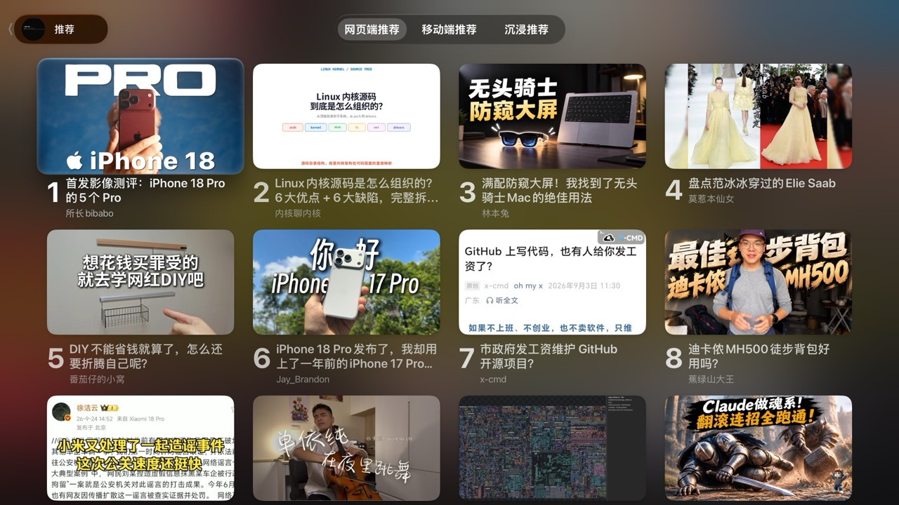
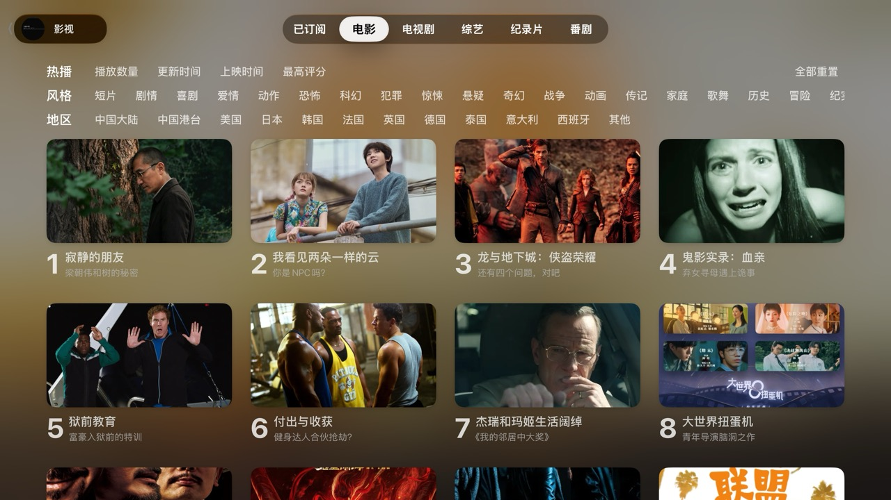
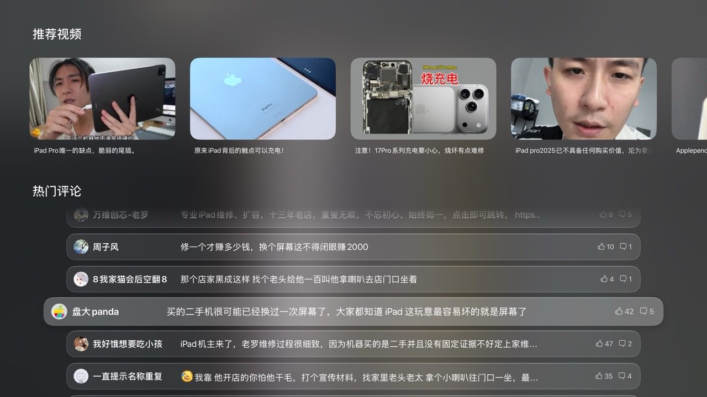
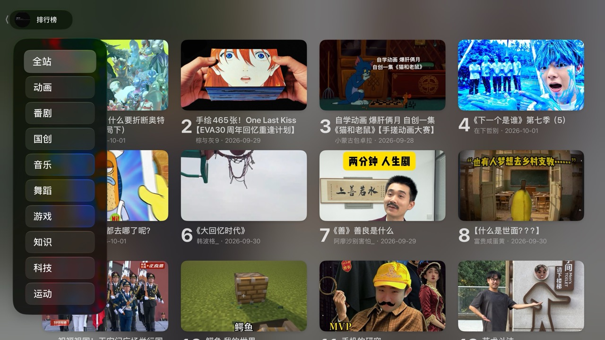
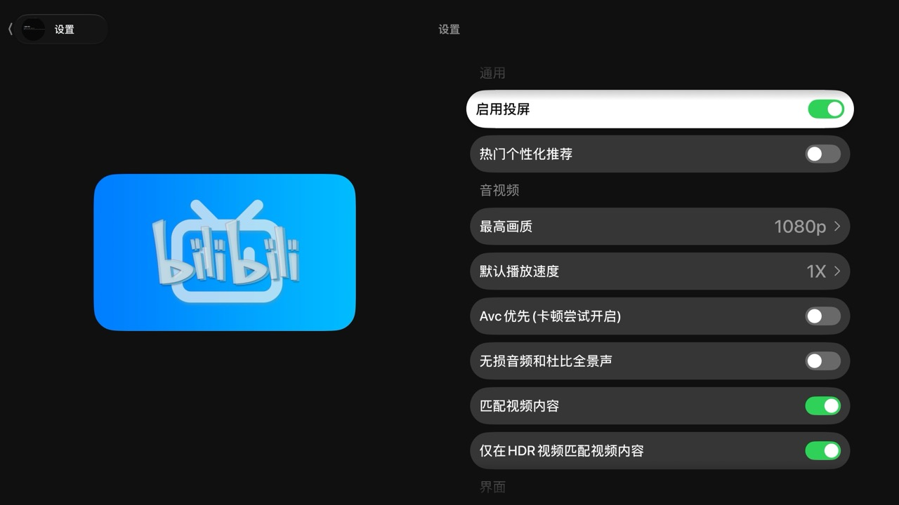

# BiliBili tvOS 客户端 Demo 由开源（https://github.com/yichengchen/ATV-Bilibili-demo.git）fork：

### 本项目没有任何授权的 Testflight 发放以及任何收费版本，请注意辨别和考虑安全性问题。

 **BiliBili tvOS 客户端 Demo 从未在任何平台上架和收费（包括AppStore与Testflight）**

 如果您在任何平台上看到有人以收费方式提供本项目的服务或应用，请注意这是**未经授权的**行为，并且与我们的原始意图不符。我们强烈谴责将本项目用于商业盈利的行为，由此引发的任何安全风险与此项目无关。

### 支持功能
- 二维码登录
- 云视听小电视投屏协议
- 直播与弹幕
- 推荐Feed
- 热门
- 排行榜
- 搜索
- 关注列表
- 历史播放
- 稍后再看
- 系统播放器播放视频
- 视频弹幕
- 热门评论
- 弹幕防挡
- 云视听投屏
- HDR播放
- 字幕

### 界面预览

#### 推荐首页

#### 影视与横向筛选

#### 视频详情

#### 推荐视频与热门评论

#### 排行榜

#### 设置

### Telegram Group
 - https://t.me/appletvbilibilidemo

### 未签名iPA文件
  登录 GitHub 账号，在[本仓库的构建工作流](https://github.com/Hotinosin/ATV-Bilibili-demo/actions/workflows/build.yml)寻找最新成功运行底部的 Artifacts 下载。未签名 IPA 安装前需要签名。

### Links

- App Icon [【22娘×33娘】亲爱的UP主，你怎么还在咕咕咕？](https://www.bilibili.com/video/BV1AB4y1k7em)

- [thmatuza/MPEGDASHAVPlayerDemo](https://github.com/thmatuza/MPEGDASHAVPlayerDemo)

- [dreamCodeMan/B-webmask](https://github.com/dreamCodeMan/B-webmask)

- [分析Bilibili客户端的“哔哩必连”协议](https://xfangfang.github.io/028)
